# Matematika
Materiály na maturitu z matematiky

Zdroj: https://maturita.cermat.cz/menu/katalogy-pozadavku

- ## Číselné obory
    - ### 1.1 Přirozená čísla (**_N_**)
        - #### Nezáporná celá čísla
        - [ ] provádět aritmetické operace s přirozenými čísly
        - [ ] rozlišit **prvočíslo a číslo složené**, **rozložit přirozené číslo na prvočinitele**
            - **Prvočinitel:** zobecnění prvočísel
                - p v R kde p není 0 ani 1; kde a,b jsou v R; pokud p dělí a\*b tak p dělí a i b
            - **Prvočíslo** = číslo dělitelné 1 a samo sebou (1 není prvočíslo)
            - **Číslo složené** = má více jak 2 dělitele (1 není složené číslo)
        - [ ] užít pojem **dělitelnost** přirozených čísel a **zanky dělitelnost**
            - **Znaky dělitelnosti:**
                - 2: pokud má **2/4/6/8 na místě jednotek**
                - 3: pokud je **ciferný součet dělitelný třemi**
                - 4: pokud je **poslední dvojčíslí dělitelné 4**
                - 5: pokud má **0/5 na místě jednotek**
                - 6: pokud je **dělitelné dvěmi a zároveň třemi**
                - 7: pokud je **rozdíl zbývající části a poslední číslice vynásobené dvakrát dělitelný 7**
                - 8: pokud je **poslední trojčíslí dělitelné 8**
                - 9: pokud je **ciferný coučet dělitelný 9**
        - [ ] rozlišit **čísla soudělná a nesoudělná**
            - Soudělná čísla
                - Mají několik společných dělitelů
            - Nesoudělná čísla
                - Mají jednoho společného dělitele (jedničku)
        - [ ] určit **největšího společného dělitele** a **nejmenší společný násobek** přirozených čísel
            - [**Největší společný dělitel**](https://clanky.rvp.cz/wp-content/upload/obrazky/7341/full/1.jpg?100650000000)
                - Pomocí prvočíselného rozkladu dojdeme na prvočísla
                - Vybereme ty prvočísla které mají **obě čísla společné** a vynásobíme je
                - Např: 600: 2\*2\*2\*3\*5\*5; 140: 2\*2\*5\*7; D(600, 140) = 2\*2\*5 = 20
            - [**Nejmenší společný násobek**](https://clanky.rvp.cz/wp-content/upload/obrazky/7341/full/2.jpg?100848000000)
                - Pomocí prvočíselného rozkladu dojdeme na provčísla
                - Stejná čísla rovnou skládáme do mocnin
                - Vybereme **čísla s největší mocninou z dvou rozkladů**
                - Např: 600: 2^3\*3\*5^2; 140: 2^2\*5\*7; N(600, 400) = 2^3\*3\*5^2\*7 = 4 200
    - ### 1.2 Celá čísla (**_Z_**)
        - #### **Přirozená čísla, nula a záporná čísla**
        - [ ] provádět aritmetické operace s celými čísly
        - [ ] užít pojem **opačné číslo**
            - Pro x je opačné číslo -x
    - ### 1.3 Racionální čísla  (**_Q_**)
        - #### **Čísla která lze vyjádřit jako zlomek**
        - [ ] pracovat s různými tvary zápisu racionálního čísla a jejich převody
        - [ ] užít **dekadický zápis čísla**
            - 357 = 3\*10^2 + 5\*10^1 + 7\*10^0 = 3\*100 + 5\*10 + 7\*1
        - [ ] provádět **operace se zlomky**
            - TODO
        - [ ] provádět **operace s desetinnými čísly** včetně zaokrouhlování, určit řád čísla
            - TODO
        - [ ] řešit úlohy na **procenta a zlomky**, užívat **trojčlenku a poměr**
            - Trojčlenka:
                - Přímá úměra:
                    - ↑ a ..... b  ↑
                    - ↑ c ..... x? ↑
                    - x = b\*c/a
                - Nepřímá úměra
                    - ↓ a ..... b  ↑
                    - ↓ c ..... x? ↑
                    - x = b\*a/c
            - Poměr:
                - TODO
        - [ ] znázornit racionální číslo na číselné ose, porovnávat racionální čísla
        - [ ] užívat **jednotky a jejich převody**
    - ### 1.4 Reálná čísla  (**_R_**)
        - #### **Čísla kterým lze jednoznačně přiřadit body nekonečné přímky**
        - [ ] zařadit číslo do příslučného číselného oboru
        - [ ] provádět aritmetické operace v číselných oborech, porovnávat reálná čísla
        - [ ] užít pojmy **opačné číslo a převrácené číslo**
            - Opačné číslo: pro x je opačné číslo -x
            - Převrácené číslo: zaměníme čitatele a jmenovatele zlomku
        - [ ] znázornit reálné číslo nebo jeho **aproximaci na číselné ose**
        - [ ] určit **absolutní hodnotu** reálného čísla a chápat její geometrický význam
            - |x| >= 0
            - |-x| >= 0
            - na ose: vzdálenost bodu od nuly
        - [ ] provádět **operace s mocninami s celočíselným a racionálním exponentem a odmocninami**
            - 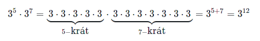
            - 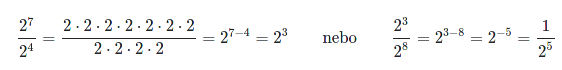
            - 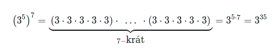
            - 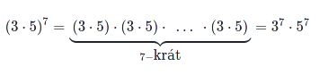
            - 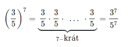

            - 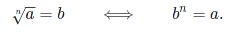

            - 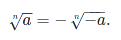
            - 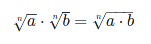
            - 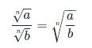
            - 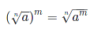
            - 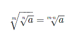
            - 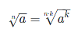

        - [ ] řešit praktické úlohy s **mocninami s přirozeným exponentem a odmocninami**
    - ### 1.5 Číselné množiny
        - [ ] užívat označení **číselných oborů *N*, *Z*, *Q* a *R***
        - [ ] zapisovat a znázorňovat **číselné množiny a intervaly**, určovat jejich **průnik a sjednocení**
            - **Zápis:**
                - A = {1,2,3,4} // Výpis prvků v množině
                - A = ∅ // A je prázdná množina
                - |A| = 4 // Počet prvků v množině
                - A ⊂ B // A je podmnožinou B
                - A ⊃ B // A je množina nadřazená množině B
                - x ∈ A // x se nachází v množině A
                - x ∉ A // x se nenachází v množině A
            - **Průnik:** A ∩ B
            - **Sjednocení:** A ∪ B
